# _***Sistema de ventas de un SkateShop (Tienda de Patinetas)***_

## _***1. DESCRIPCION DEL SISTEMA DE VENTAS***_

### En esta sección describiremos el funcionamiento de las ventas en un SkateShop para asi entender como es el flujo de los datos de las ventas y de los balances generales contables de la empresa, el skateshop tiene sucursales en 5 países de su region y distribuye sus productos en 21 ciudades dentro de estos países, Este se encarga de distribuir patinetas de diferentes marcas, modelos, tallas y tecnologías que se ajustan a las características de cada consumidor, para esto requerimos diseñar una base de datos donde podamos almacenar toda esta informacion y asi tener un mayor entendimiento de como funciona la parte de ventas del skateshop

## _***1.1. CLIENTES:***_

### La empresa tiene 3 tipos de clientes potenciales

### Franquicias de SkateShops, SkateShops Grandes, SkateShops Pequeños a los cuales se distribuyen los productos que ordenan

## _***1.2. METODOS DE PAGO:***_

### La empresa a su vez ofrece a dichos clientes varios métodos de pago a la hora de adquirir sus productos entre ellos podemos encontrar

### Efectivo, Crédito, Debito, Cheques

## _***1.3. FACTURACIÓN:***_

### Una vez el comprador decide hacer el pago del pedido al skateShop, este genera una factura de compra donde se guardaran todos los datos de los productos adquiridos por el cliente, La factura será entregada al comprador de forma física y a su vez esta factura será almacenada en la base de datos para tener un registro de todas las ventas realizadas a lo largo de tiempo

## _***1.4. EMPRESAS DE ENVIOS:***_

### Cuando finaliza el proceso de facturación el comprador elige la empresa de envíos de preferencia asociada con la distribuidora de patinetas

### DHL, FedEx, UPS, Schenker, TNT

## _***1.5. PRODUCTO:***_

### cada uno de los productos ofrecidos por el skateShop tienen diferentes caracteriscticas que se adaptan a cada persona en particular

### Material, Tecnologia, Marca, Talla

## _***1.6. Categorias de los productos***_

### Cada uno de los productos ofrecidos por el skateShop tiene varias categorias dependiendo de sus caracteristicas

### Alta, media, baja

### La base de datos del skateshop nos debe permitir almacenar todos estos datos generados en las ventas para asi gestionar el flujo de los mismos de acuerdo a la facturacion obtenida por cada uno de los articulos que ofrece la empresa, esto es fundamental para ver como es el comportamiento de las ventas a lo lardo del tiempo

## 2. _***ENTIDADES Y ACTORES***_

## _***2.1. MATERIAL***_

### La entidad _***MATERIAL***_ contiene la información del material con el que estan fabricadas las patinetas que se distribuyen por el skateShop, esta entidad contiene los siguientes atributos

### _***ID_material***_ - _***Material***_

## _***2.2. TECNOLOGIA***_

### La entidad _***TECNOLOGIA***_ contiene la informacion de las tecnologias con las que estan fabricadas las patinetas que se ofrecen el skateShop, esta entidad contiene los siguientes atributos

### _***ID_Tecnologia***_ - _***Tecnologia***_

## _***2.3. TALLA***_

### La entidad _***TALLA***_ contiene la informacion de todas las tallas disponibles en los articulos ofrecidos por la empresa, esta entidad contiene los sigueintes atributos

### _***ID_Talla***_ - _***Talla***_

## _***2.4. MARCA***_

### La entidad _***MARCA***_ contiene la informacion de todas las marcas que ofrece la empresa a sus clientes, esta entidad contiene los siguientes atributos

### _***ID_Marca***_ - _***Marca***_

## _***2.5. ENVIO***_

### La entidad _***ENVIO***_ contiene la informacion de las empresas por medio las cuales el skateShop realiza los envios de los productos a sus compradores, esta entidad contiene los siguientes atributos

### _***ID_Envio***_ - _***Envio***_

## _***2.6. CIUDAD***_

### La entidad _***CIUDAD***_ contiene la informacion de las ciudades donde se localizan los clientes del skateShop, esta entidad contiene los siguientes atributos

### _***ID_Ciudad***_ - _***Ciudad***_

## _***2.7. PAIS***_

### La entidad _***PAIS***_ contiene la informacion de los paises donde se encuentran los clientes de la empresa, esta entidad contiene los siguientes atributos

### _***ID_Pais***_ - _***Pais***_

## _***2.8. TIPO_DE_CLIENTE***_

### La entidad _***TIPO_DE_CLIENTE***_ contiene la informacion sobre el tipo de clientes que tiene la empresa, esta entidad contiene los siguientes atributos

### _***ID_Tipo***_ - _***Descripcion***_

## _***2.9. CATEGORIA_ARTICULO***_

### La entidad _***CATEGORIA_ARTICULO***_ contiene toda la información de la gamma de los productos vendidos en la empresa, esta entidad contiene los siguientes atributos

### _***ID_Cat***_ - _***Cat_Articulo***_

## _***2.10. TIPO_PAGO***_

### La entidad _***TIPO_PAGO***_ contiene toda la informacion sobre los metodos de pago que los clientes de la empresa pueden elegir para adquirir los articulos ofrecidos por la empresa, este entidad contiene los siguientes atributos

### _***ID_Pago***_ - _***Tipo_pago***_

## _***2.11. CLIENTE***_

### La entidad _***CLIENTE***_ contiene toda la información de los clientes que compran los productos de la empresa, para asi poder hacer el envio correspondiente, esta entidad contiene los siguientes atributos

### _***- ID_Cliente***_ - _***ID_Envio***_ - _***ID_Pais***_ - _***ID_Ciudad***_ - _***Nombre_Cliente***_ - _***EMAIL***_

## _***2.12. ARTICULO***_

### Contiene toda la información de los productos que ofrece la distribuidora de patinetas a sus clientes, Esta entidad contiene los siguientes atributos

### _***ID_Articulo***_ - _***ID_Marca***_ - _***ID_Cat***_ - _***ID_talla***_ - _***ID_Tecnologia***_ - _***ID_Material***_ -  _***Costo***_ - _***Precio***_ -  _***- Descripcion***_

## _***2.13. FACTURA***_

### La entidad _***FACTURA***_ contiene la información que se registrara en la base de datos acerca de las ventas realizadas, esta entidad contiene los siguientes atributos

### _***ID_Factura***_ - _***ID_pago***_ - _***Fecha***_ - _***Factura***_

## _***2.14. FACTURACION***_

### La entidad _***FACTURACION***_ se comporta como la tabla de hechos de nuestro sistema y contiene toda la informacion sobre las ventas que se han generado en el ciclo de vida del skateShop, esta entidad contiene los siguientes atributos

### _***ID_Facturacion***_ - _***ID_Factura***_ - _***ID_Articulo***_ - _***ID_Marca***_ - _***ID_Cliente***_ - _***ID_Pais***_ - _***ID_Ciudad***_ - _***ID_Tipo***_ - _***ID_Pago***_ - _***Num_Factura***_ - _***Cantidad***_ - _***Precio***_ - _***Costo***_

## _***3. DIAGRAMA ENTIDAD RELACION***_

## _***4. TABLAS USADAS EN LA BASE DE DATOS PARA EL SISTEMA DE FACTURACION***_

## _***4.1. MATERIAL:***_ Contiene la información del material con el que estan fabricadas las patinetas que se distribuyen por el skateShop, esta tabla se relaciona con la tabla _***ARTICULO***_

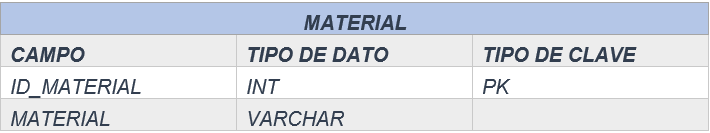

## _***4.2. TECNOLOGIA:***_ Contiene la informacion de las tecnologias con las que estan fabricadas las patinetas que se ofrecen el skateShop, esta tabla se realciona con la tabla _***ARTICULO***_

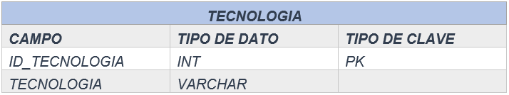

## _***4.3. TALLA:***_ Contiene la informacion de todas las tallas disponibles en los articulos ofrecidos por la empresa, esta  tabla se relaciona con la tabla _***ARTICULO***_

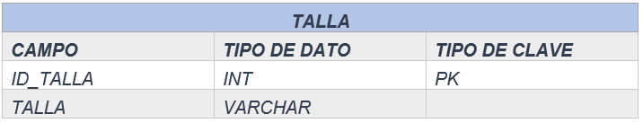

## _***4.4. MARCA:***_ Contiene la informacion de todas las marcas que ofrece la empresa a sus clientes, esta tabla se relaciona con la tabla _***ARTICULO***_

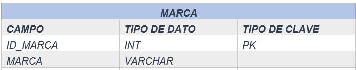

## _***4.5. ENVIO:***_ Contiene la informacion de las empresas por medio las cuales el skateShop realiza los envios de los productos a sus compradores, Esta tabla se relaciona con la tabla _***CLIENTE***_

## _***4.6. CIUDAD:***_ Contiene la informacion de las ciudades donde se localizan los clientes del skateShop, esta tabla se relaciona con las tablas _***CLIENTE & Facturacion***_

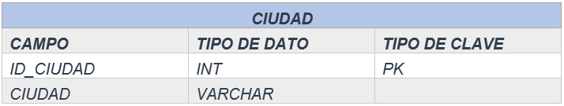

## _***4.7. PAIS:***_ Contiene la informacion de los paises donde se encuentran los clientes de la empresa, esta tabla se relaciona con las tablas _***CLIENTE & Facturacion***_

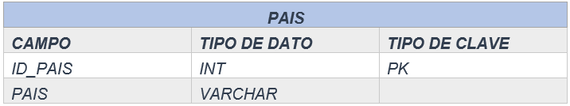

## _***4.8. TIPO_CLIENTE:***_ Contiene la informacion sobre el tipo de clientes que tiene la empresa, esta tabla se relaciona con la tabla _***FACTURACION***_

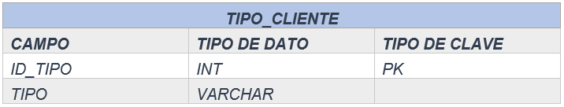

## _***4.9. CATEGORIA_ARTICULO:***_ Contiene toda la información de la gamma de los productos vendidos en la empresa, esta tabla se relaciona con la tabla _***ARTICULO***_

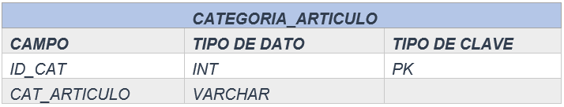

## _***4.10. TIPO_PAGO:***_ Contiene toda la informacion sobre los metodos de pago que los clientes de la empresa pueden elegir para adquirir los articulos ofrecidos por la empresa, esta tabla se relaciona con las tablas _***FACTURA & FACTURACION***_

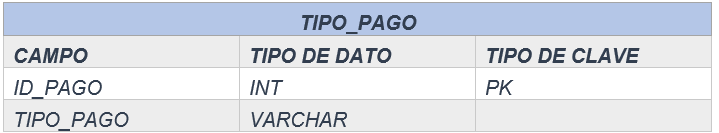

## _***4.11. CLIENTE:***_ Contiene toda la información de los clientes que compran los productos de la empresa, esta tabla se relaciona con la tabla _***FACTURACION***_

## _***4.12. ARTICULO:***_ Contiene toda la informacion sobre los articulos que se venden en el skateShop, esta tabla se relaciona con la tabla _***FACTURACION***_

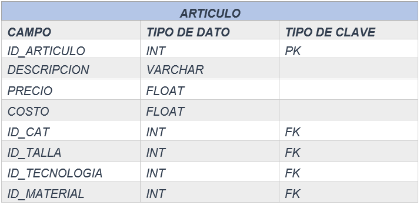

## _***4.13. FACTURA:***_ Contiene toda la información de los productos que ofrece la distribuidora de patinetas a sus clientes, esta tabla se relaciona con la tabla _***FACTURACION***_

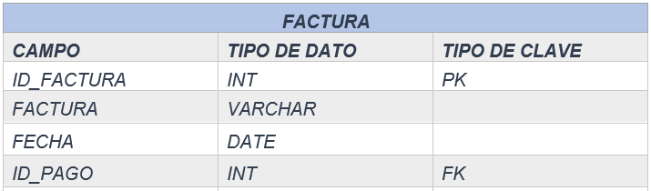

## _***4.14. FACTURACION:***_  Se comporta como la tabla de hechos de nuestro sistema y contiene toda la informacion sobre las ventas que se han generado en el ciclo de vida del skateShop

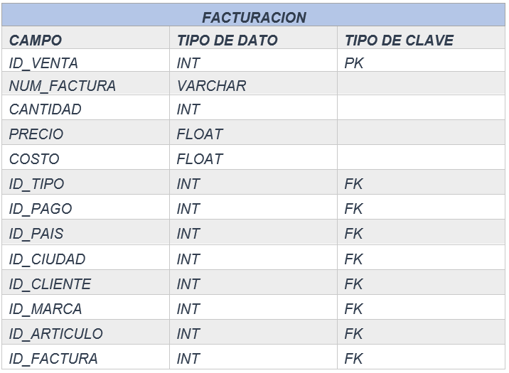

## 5. MODELO RELACIONAL

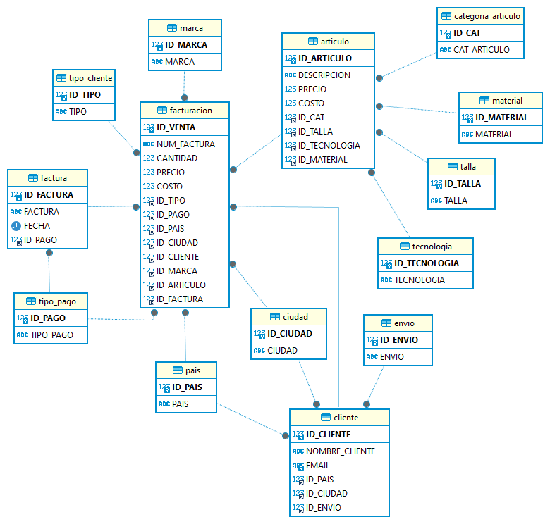
